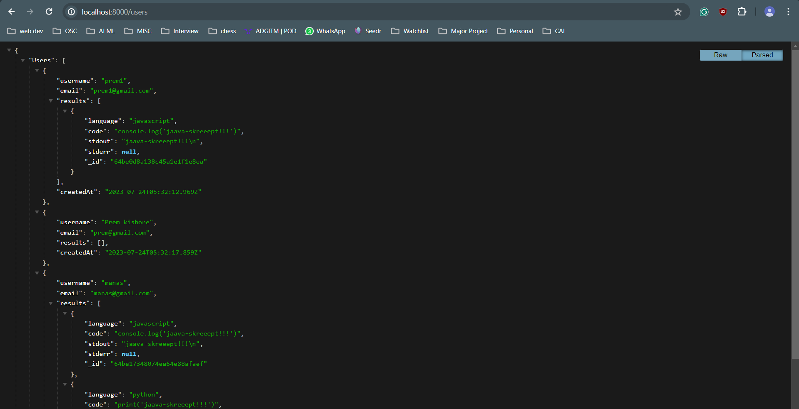
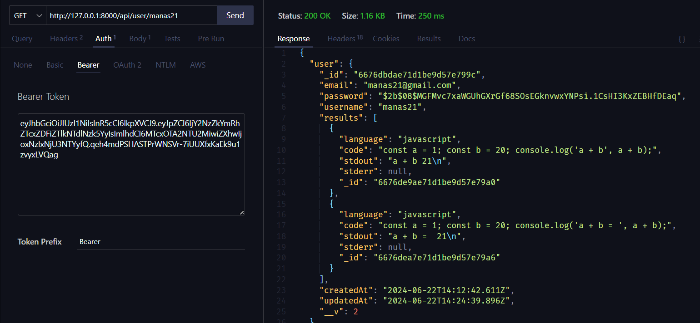
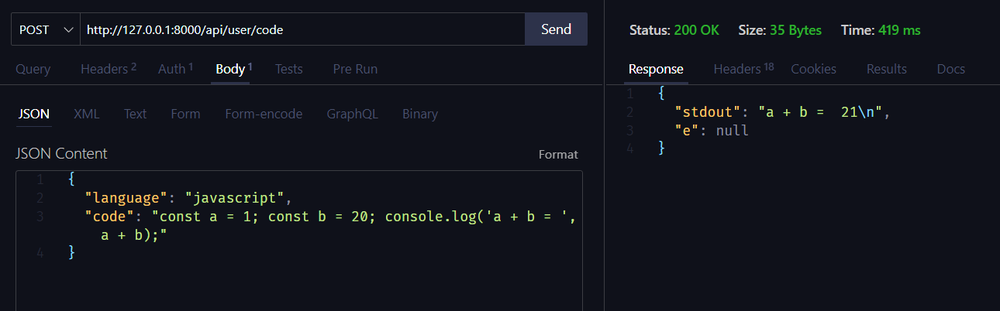
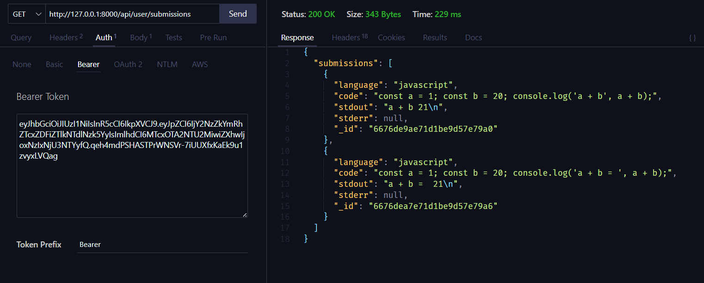
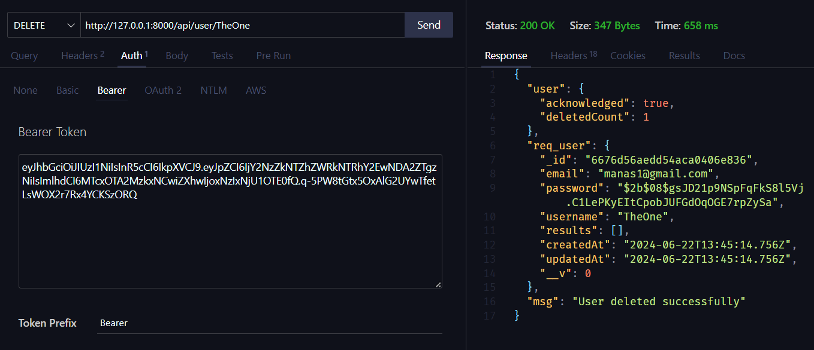
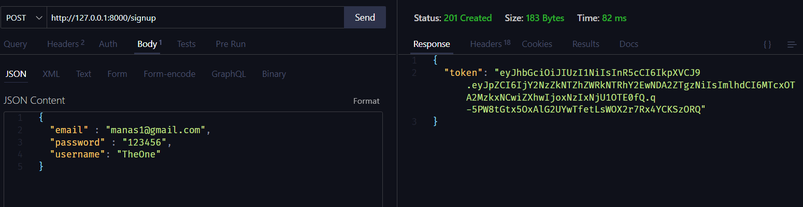

# CodeExecuter API
- A REST API made in NodeJs with Express.js that handles various endpoints for code submission, execution, and retrieval of results in Python and JavaScript.
- Implements authentication using JWT (JSON Web Tokens) to secure the API endpoints.
- Utilizes MongoDB Atlas as the database to store user data and execution results.
- Implements a secure sandbox environment for executing code.

## URL Endpoints
Method | Endpoint | Desc
:------| :-------- | :---------
GET    | `https://code-executer-api.onrender.com/`                     | Home Page
POST   | `https://code-executer-api.onrender.com/signup`               | SignIn
POST   | `https://code-executer-api.onrender.com/login`                | LogIn
GET    | `https://code-executer-api.onrender.com/users`                | Get All registered Users
GET    | `https://code-executer-api.onrender.com/api/user/:username`   | Get User details `protected`
DELETE | `https://code-executer-api.onrender.com/api/user/:username`   | Delete user `protected`
POST   | `https://code-executer-api.onrender.com/api/user/code`        | Execute code and get results `protected`
GET    | `https://code-executer-api.onrender.com/api/user/submissions` | Get User submission history `protected`

## Sample Snapshots
#### Get All Registered Users

#### Get User Details (Need to be logedIn)

#### Execute Code

#### Get submission histroy

#### Delete User

#### New User SignUp
